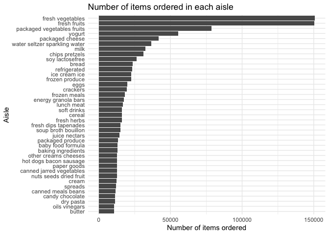
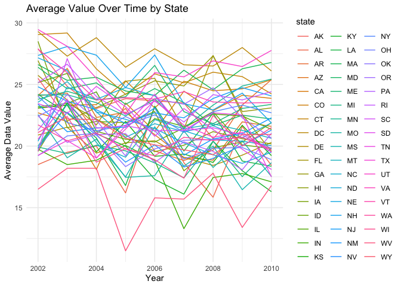
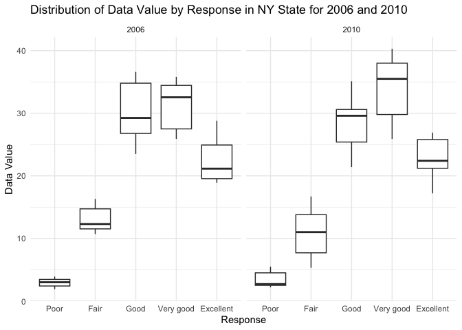

p8105_hw3_qh2284
================
Qin Huang
2023-10-06

## Problem 1

``` r
# load the dataset
library(p8105.datasets)
data("instacart")
```

**Write a short description of the dataset, noting the size and
structure of the data, describing some key variables, and giving
illustrative examples of observations.**

``` r
?instacart

user_num = instacart %>%
  distinct(user_id) %>%
  count()
```

The dataset contains 1384617 observations of 131209 unique users, where
each row in the dataset is a product from an order.

There are 15 variables in this dataset:

- `order_id`: order identifier, int type

- `product_id`: product identifier, int type

- `add_to_cart_order`: order where each product was added to cart, int
  type

- `reordered`: 1 - reordered by this user (ordered in the past), 0 - not
  reorder, int type

- `user_id`: customer identifier, int type

- `eval_set`: which evaluation set this order belongs in (train), char
  type

- `order_number`: the order sequence number for this user (1=first,
  n=nth), int type

- `order_dow`: the day of the week on which the order was placed, int
  type

- `order_hour_of_day`: the hour of the day on which the order was
  placed, int type

- `days_since_prior_order`: days since the last order, capped at 30, NA
  if `order_number`=1, int type

- `product_name`: name of the product, char type

- `aisle_id`: aisle identifier, int type

- `department_id`: department identifier, int type

- `aisle`: the name of the aisle, char type

- `department`: the name of the department, char type

**How many aisles are there, and which aisles are the most items ordered
from?**

``` r
# count for the number of aisles
ai_num = instacart %>%
  distinct(aisle) %>%
  nrow()

# find the most items ordered
aisle_most = instacart %>%
  group_by(aisle) %>%
  summarise(n = n()) %>%
  arrange(desc(n)) %>%
  head(1) %>%
  pull(aisle)
```

There’s total 134 aisles, among which fresh vegetables are the most
items ordered from.

**Make a plot that shows the number of items ordered in each aisle,
limiting this to aisles with more than 10000 items ordered. Arrange
aisles sensibly, and organize your plot so others can read it.**

``` r
# filter the aisles
more_than_1e4 = instacart %>%
  group_by(aisle) %>%
  summarise(n = n()) %>%
  filter(n > 10000) %>%
  arrange(desc(n))

# create the plot
plot_aisle = ggplot(more_than_1e4, aes(x = reorder(aisle, n), y = n)) +
  geom_bar(stat = "identity") +
  coord_flip() +  
  labs(title = "Number of items ordered in each aisle",
       x = "Aisle",
       y = "Number of items ordered") +
  theme_minimal()

plot_aisle
```

<!-- -->

``` r
# save the plot
ggsave("num of aisle.png", plot = plot_aisle)
```

    ## Saving 7 x 5 in image

We first group the aisles and count for each aisles. Then we filter the
data. To make the plots more readable, we reorder the dataset to make it
follow a descending order according to the number of aisles.

**Make a table showing the three most popular items in each of the
aisles “baking ingredients”, “dog food care”, and “packaged vegetables
fruits”. Include the number of times each item is ordered in your
table.**

``` r
# create the table for top 3 popular items
popular_item = instacart %>%
  filter(aisle %in% c("baking ingredients", "dog food care", "packaged vegetables fruits")) %>%
  group_by(aisle, product_name) %>%
  summarise(ordered_num = n()) %>%
  arrange(aisle, desc(ordered_num)) %>%
  slice_head(n = 3)
```

    ## `summarise()` has grouped output by 'aisle'. You can override using the
    ## `.groups` argument.

``` r
popular_item
```

    ## # A tibble: 9 × 3
    ## # Groups:   aisle [3]
    ##   aisle                      product_name                            ordered_num
    ##   <chr>                      <chr>                                         <int>
    ## 1 baking ingredients         Light Brown Sugar                               499
    ## 2 baking ingredients         Pure Baking Soda                                387
    ## 3 baking ingredients         Cane Sugar                                      336
    ## 4 dog food care              Snack Sticks Chicken & Rice Recipe Dog…          30
    ## 5 dog food care              Organix Chicken & Brown Rice Recipe              28
    ## 6 dog food care              Small Dog Biscuits                               26
    ## 7 packaged vegetables fruits Organic Baby Spinach                           9784
    ## 8 packaged vegetables fruits Organic Raspberries                            5546
    ## 9 packaged vegetables fruits Organic Blueberries                            4966

According to the table, we could observe that the top 3 popular in
“baking ingredients” are `Light Brown Sugar`, `Pure Baking Soda`,
`Cane Sugar`. The top 3 popular in “dog food care” are
`Snack Sticks Chicken & Rice Recipe Dog Treats`,
`Organix Chicken & Brown Rice Recipe`, `Small Dog Biscuits`. The top 3
popular in “packaged vegetables fruits” are `Organic Baby Spinach`,
`Organic Raspberries`, `Organic Blueberries`.

**Make a table showing the mean hour of the day at which Pink Lady
Apples and Coffee Ice Cream are ordered on each day of the week; format
this table for human readers (i.e. produce a 2 x 7 table).**

``` r
# first filter the table
table_mean_hour <- instacart %>%
  filter(product_name %in% c("Pink Lady Apples", "Coffee Ice Cream")) %>%
  # based on each day of the week
  group_by(product_name, order_dow) %>%
  # calculate the mean
  summarise(mean_hour = mean(order_hour_of_day)) %>%
  spread(key = order_dow, value = mean_hour)
```

    ## `summarise()` has grouped output by 'product_name'. You can override using the
    ## `.groups` argument.

``` r
table_mean_hour
```

    ## # A tibble: 2 × 8
    ## # Groups:   product_name [2]
    ##   product_name       `0`   `1`   `2`   `3`   `4`   `5`   `6`
    ##   <chr>            <dbl> <dbl> <dbl> <dbl> <dbl> <dbl> <dbl>
    ## 1 Coffee Ice Cream  13.8  14.3  15.4  15.3  15.2  12.3  13.8
    ## 2 Pink Lady Apples  13.4  11.4  11.7  14.2  11.6  12.8  11.9

In this problem, we group the table based on the product name and the
day of the week. Then we use summarise() to calculate the mean hour of
orders for these two items.

------------------------------------------------------------------------

## Problem 2

**First, do some data cleaning:**

- **format the data to use appropriate variable names;**

- **focus on the "Overall Health" topic**

- **include only responses from "Excellent" to "Poor"**

- **organize responses as a factor taking levels ordered from "Poor" to
  "Excellent"**

``` r
# load the dataset
data("brfss_smart2010")
```

``` r
# clean the data
brfss_new = brfss_smart2010 %>%
  janitor::clean_names() %>%
  rename(state = locationabbr, loc_desc = locationdesc) %>%
  # focus on the “Overall Health” topic
  filter(topic == "Overall Health") %>%
  # include only responses from “Excellent” to “Poor”
  filter(!response %in% c("Yes","No","Yes, pregnancy-related")) %>%
  # organize responses as a factor taking levels ordered from “Poor” to “Excellent”
  mutate(response = factor(response, 
                           levels = c("Poor", "Fair", "Good", "Very good", "Excellent"),
                           ordered = TRUE))
```

**In 2002, which states were observed at 7 or more locations? What about
in 2010?**

``` r
# For 2002
states_2002 = brfss_new %>%
  filter(year == 2002) %>%
  group_by(state) %>%
  summarise(num_loc = n_distinct(loc_desc)) %>%
  filter(num_loc >= 7) %>%
  pull(state)

# For 2010
states_2010 = brfss_new %>%
  filter(year == 2010) %>%
  group_by(state) %>%
  summarise(num_loc = n_distinct(loc_desc)) %>%
  filter(num_loc >= 7) %>%
  pull(state)
```

In 2002, CT, FL, MA, NC, NJ, PA could be observed at 7 or more
locations.

In 2010, CA, CO, FL, MA, MD, NC, NE, NJ, NY, OH, PA, SC, TX, WA could be
observed at 7 or more locations.

**Construct a dataset that is limited to `Excellent` responses, and
contains, year, state, and a variable that averages the `data_value`
across locations within a state. Make a "spaghetti" plot of this average
value over time within a state (that is, make a plot showing a line for
each state across years – the `geom_line` geometry and `group` aesthetic
will help).**

``` r
# construct only excellent dataset
brfss_excellent = brfss_new %>%
  filter(response == "Excellent") %>%
  group_by(year, state, loc_desc) %>%
  summarise(avg_data = mean(data_value, na.rm = T))
```

    ## `summarise()` has grouped output by 'year', 'state'. You can override using the
    ## `.groups` argument.

``` r
# create spaghetti plot
ggplot(brfss_excellent, aes(x = year, y = avg_data, group = state, color = state)) +
  geom_line() +
  labs(title = "Average Value Over Time by State",
       x = "Year",
       y = "Average Data Value") +
  theme_minimal()
```

<!-- -->

Comment:

**Make a two-panel plot showing, for the years 2006, and 2010,
distribution of `data_value` for responses ("Poor" to "Excellent") among
locations in NY State.**

``` r
# filter the year for only 2006 and 2010
plot_ny = brfss_new %>%
  filter(year == 2006 | year == 2010) %>%
  filter(state == "NY") 

ggplot(plot_ny, aes(x = response, y = data_value)) +
  geom_violin() +  # or geom_violin() for a violin plot
  facet_wrap(~ year, ncol = 2) +
  labs(title = "Distribution of Data Value by Response in NY State for 2006 and 2010",
       x = "Response",
       y = "Data Value") +
  theme_minimal()
```

<!-- -->

Comment:

------------------------------------------------------------------------
